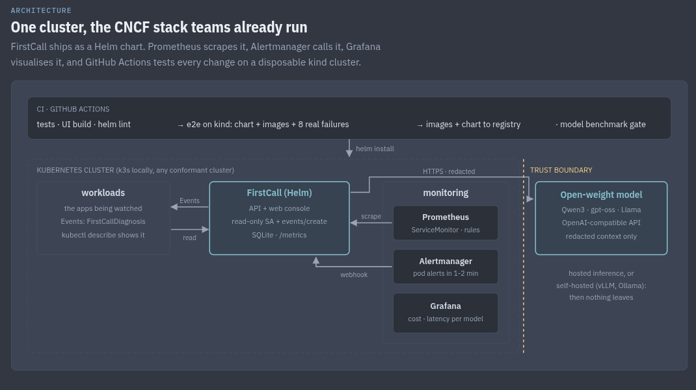
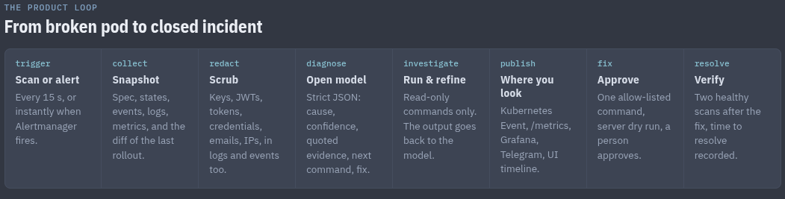
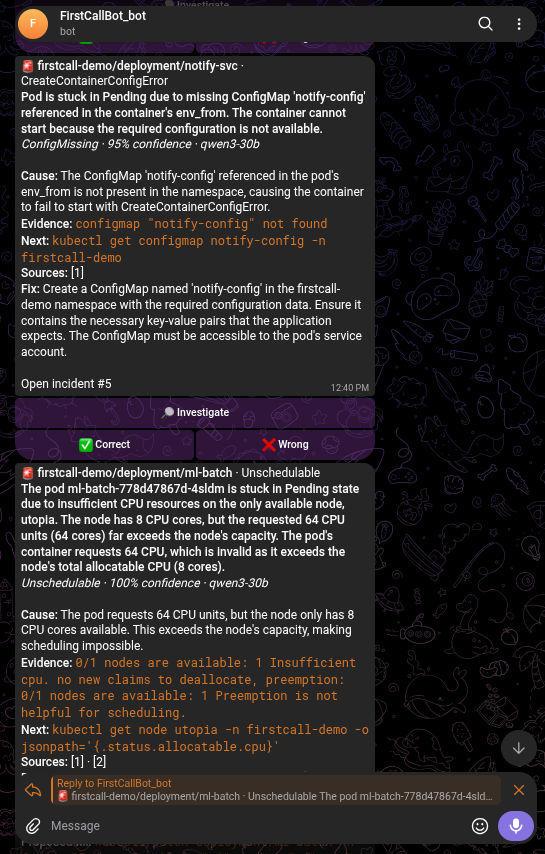

# FirstCall

The first responder for Kubernetes incidents.

FirstCall runs inside your cluster and watches your workloads. When one breaks, it collects what
an on-call engineer would look at in the first 15 minutes: pod spec, container states, events,
current and previous logs, metrics, related Services and PVCs, and what changed in the last
rollout. It removes secrets from that snapshot and asks an open-weight model for a diagnosis
backed by quoted evidence. It then runs one read-only `kubectl` command to confirm the cause,
proposes a fix that a person approves after a server dry run, and tracks the incident until the
cluster is healthy again.

Results go where engineers already look: Kubernetes Events on the broken workload, Prometheus
metrics, a Grafana dashboard, Telegram or Slack, and a web console.

- Open-weight models through any OpenAI-compatible API: Nebius Token Factory, vLLM, Ollama,
  OpenRouter, Groq. With a self-hosted model, no data leaves the cluster.
- Read-only by default. Fixes are allow-listed, dry-run, and applied only after a named person
  approves them.
- Installs with one Helm chart on any conformant cluster, amd64 or arm64.

Licensed under Apache 2.0.

## Architecture



FirstCall ships as a Helm chart. Prometheus scrapes it, Alertmanager calls it, Grafana shows cost
and latency per model, and GitHub Actions runs every change against a disposable kind cluster
with real failures. Everything that crosses the trust boundary to the model is redacted first.

## How an incident is handled



1. **Trigger** - a scan every 15 s, or immediately when Alertmanager fires.
2. **Snapshot** - spec, states, events, logs, metrics and the diff of the last rollout. Env var
   names are collected, never their values. Secrets are never read.
3. **Redact** - keys, JWTs, tokens, credentials, emails and IPs are removed from logs and events.
4. **Diagnose** - one structured call: category, root cause, confidence, quoted evidence, next
   command, proposed fix.
5. **Investigate** - the next command runs only if it is on the read-only allow-list; its output
   goes back to the model to refine the answer.
6. **Publish** - Kubernetes Event, `/metrics`, Grafana, Telegram or Slack, console timeline.
7. **Fix** - one allow-listed command, server dry run, a person approves the exact command.
8. **Verify** - resolved after two healthy scans; time to resolve is recorded.

Alerts on Telegram come with Investigate, Correct and Wrong buttons, and the bot answers
`/status`, `/incidents` and `/mode`:



## Install on any cluster

Requirements: Kubernetes 1.34 or newer, Helm 3, and a model endpoint (a Nebius Token Factory key,
or an in-cluster vLLM/Ollama).

```bash
kubectl create namespace firstcall-system
kubectl -n firstcall-system create secret generic firstcall-keys \
  --from-literal=NEBIUS_API_KEY=...            # add TELEGRAM_BOT_TOKEN, SLACK_WEBHOOK_URL if used

helm install firstcall oci://ghcr.io/adam-bouafia/charts/firstcall \
  -n firstcall-system --set existingSecret=firstcall-keys

kubectl -n firstcall-system port-forward svc/firstcall-web 3000:3000   # console on localhost:3000
```

By default FirstCall watches every namespace except `kube-*` and its own, exposes nothing outside
the cluster, and does not change anything. Common settings:

| setting | what it does |
|---|---|
| `watch.namespaces=team-a\,team-b` | watch only these (escape commas with `--set`) |
| `watch.exclude=monitoring` | with the default `"*"`, skip more namespaces |
| `model.default=qwen3-30b` | model key from `backend/app/models.yaml`, `cascade`, or `provider:model-id` |
| `ollamaBaseUrl=http://ollama.ai:11434/v1/` | use a self-hosted model, then set `model.default=local-...` |
| `remediation.enabled=true` | allow approved fixes; needs an explicit `watch.namespaces` list |
| `web.ingress.enabled=true` | Ingress for the console (`className`, `host`, `tls`) |
| `metrics.serviceMonitor.enabled=true` | Prometheus Operator scraping, plus `metrics.prometheusRule` and `dashboard` |
| `telegram.chatIds=123,456` | where alerts go; `alerting.mode=offhours` pages only outside office hours |
| `podSecurityContext.api.runAsUser=null` | OpenShift: let the platform assign UIDs (same for `.web`) |
| `nodeSelector`, `tolerations`, `affinity` | scheduling for both pods |

All options with comments: [charts/firstcall/values.yaml](charts/firstcall/values.yaml).

**The console has no login.** Anyone who can reach it can read incidents and approve fixes. Keep
it behind `port-forward`, or put authentication in front of the Ingress (oauth2-proxy, your
ingress controller's auth) before enabling it. See [SECURITY.md](SECURITY.md).

### Cloud and on-prem notes

- **EKS, AKS, GKE:** the defaults work; the PVC uses the cluster's default StorageClass
  (`persistence.storageClass` to override). Use your ingress class for `web.ingress.className`.
- **On-prem and air-gapped:** mirror `ghcr.io/adam-bouafia/firstcall-backend` and
  `firstcall-frontend` to your registry (`image.api.repository`, `image.web.repository`,
  `imagePullSecrets`) and point FirstCall at an in-cluster model so no traffic leaves.
- **Single replica by design:** SQLite and the in-process watcher mean one API pod
  (`Recreate` strategy). Size the PVC for incident history (1 Gi is plenty for most teams).

## Try it locally

On a laptop (Fedora, 16 GB, no Docker needed), k3s and 12 deliberately broken workloads:

```bash
make setup                # venv + npm, creates .env from .env.example
# put NEBIUS_API_KEY in .env
make cluster              # k3s + the broken scenarios (about 90 s to break). Not with sudo
make dev                  # API :8000 + UI :3000 on the host, watching the cluster
```

Or install the product shape into that cluster: `make stack` (images, kube-prometheus-stack,
FirstCall, Grafana on :30301, console on :30300).

No cluster and no model key: `make mock` runs the console on recorded snapshots with canned
answers. Step by step, including kind: [docs/local-setup.md](docs/local-setup.md).

```bash
make fix S=07-service-selector   # repair one scenario and watch the incident resolve
make fix-all                     # repair all of them
make reset                       # break everything again
```

## Scenarios

Each scenario has a manifest (the broken change, often on top of a healthy baseline so rollout
history shows what changed), a fix script, and a recorded snapshot with ground truth for the
benchmark. The later ones are built so the obvious symptom points at the wrong cause.

| workload | what is broken | fix |
|---|---|---|
| payments-api | `DATABASE_URL` removed in the last rollout, CrashLoopBackOff; logs leak a fake Stripe key | rollout undo or `set env` |
| checkout-web | image tag `busybox:1.63` (meant 1.36) | `set image` |
| report-worker | unbounded load under a small memory limit, OOMKilled | raise the limit |
| ml-batch | requests 64 CPUs | `set resources` |
| catalog-api | readiness probe on :8080, app serves :80 | probe port 80 |
| notify-svc | `envFrom` ConfigMap `notify-config` missing | create it |
| orders | Service selects `app=orders`, pods are `app=orders-api`, 0 endpoints, nothing crashes | fix the selector |
| ledger-db | PVC wants StorageClass `fast-ssd`, which does not exist | recreate the PVC |
| auth-svc | Secret exists, but the new version reads key `password`; the Secret has `db_password` | rollout undo or patch the key |
| search-api | new liveness probe kills the app during its 15 s warm-up; exit 137 looks like OOM | `initialDelaySeconds` or startupProbe |
| cart-api | crash-loops because `inventory-db` was scaled to 0; its own spec did not change | scale the dependency back up |
| gpu-inference | `nodeSelector accelerator=nvidia-a100`, no node has it; more resources do not help | remove the selector |

## Models

| key | provider | use |
|---|---|---|
| `qwen3-30b` (default) | Nebius Token Factory | fast first pass, about $0.0003 per diagnosis |
| `qwen3-235b` | Nebius | hard cases |
| `gpt-oss-120b` | Nebius | best open score in the benchmark |
| `nemotron-nano` | Nebius | cheapest per token |
| `cascade` | Nebius | 30B first, 235B only when confidence is low |
| `groq-gpt-oss-120b`, `cerebras-gpt-oss-120b` | Groq, Cerebras | free-tier fallbacks |
| `local-*` | Ollama | self-hosted |

Anything else: `provider:model-id`, for example `nebius:deepseek-ai/DeepSeek-V3-0324`.

## Benchmark

Open models against a keyword-rules floor and Claude Sonnet 5 as a closed reference, on the
original 8 scenarios recorded from a live cluster, same prompt and scoring:

| model | score | root cause | category | right fix | p50 latency | cost / 1k incidents |
|---|---|---|---|---|---|---|
| Claude Sonnet 5 (reference) | 1.00 | 100% | 100% | 100% | 7.4 s | n/a |
| gpt-oss-120b | 0.97 | 100% | 100% | 100% | 3.9 s | $0.62 |
| qwen3-30b | 0.95 | 100% | 100% | 80% | 9.9 s | $0.24 |
| rules (no model) | 0.71 | 31% | 88% | 100% | 0.2 s | $0.00 |

Open models matched the closed reference on root cause; the gap is in which follow-up command
they choose. The scenarios and ground truth are written by the author, so read this as a
regression gate, not a claim of general accuracy. CI re-runs it on every change to the prompt or
collector and fails below 0.60. Details and caveats: [docs/benchmark.md](docs/benchmark.md).

```bash
make bench PROVIDER=nebius           # every Nebius model x every scenario x 3, plus the rules floor
make bench-k8sgpt PROVIDER=nebius    # adds k8sgpt on the live cluster, same model
```

## API

| method | path | |
|---|---|---|
| GET | `/health`, `/api/stats`, `/api/models`, `/metrics` | |
| GET | `/api/incidents`, `/api/incidents/{id}` | list, detail with timeline |
| POST | `/api/incidents/{id}/diagnose` `{model?}` | re-diagnose |
| POST | `/api/incidents/{id}/investigate` `{model?}` | run the read-only next command, refine |
| POST | `/api/incidents/{id}/feedback` `{value}` | correct or wrong |
| GET | `/api/incidents/{id}/snapshot` | exactly what the model sees, redacted |
| POST | `/api/incidents/{id}/remediation/preview` | server dry run of the proposed fix |
| POST | `/api/incidents/{id}/remediation/apply` `{hash, approver}` | apply after approval |
| POST | `/api/scan`, `/api/alertmanager` | scan now; Alertmanager webhook receiver |
| GET/POST | `/api/alerting` `{mode}` | alert mode: `always` or `offhours` |
| GET | `/api/activity?since=` | live activity feed |

## Repository layout

```
backend/app/       engine (loop), store (SQLite), metrics, k8s/ (collector, events, fixtures),
                   llm/ (client, prompt), diagnose, investigate, redact, safety, remediate
frontend/          Next.js console; /fc/* proxies to the API
charts/firstcall/  Helm chart and Grafana dashboard
deploy/monitoring/ kube-prometheus-stack values wired to FirstCall
bench/             scoring harness, k8sgpt baseline, recorded results
scenarios/         baseline/, manifests/ (break), fixes/ (repair), fixtures/ (snapshots + ground truth)
scripts/           cluster setup, break, capture, e2e, secret creation
docs/              architecture decisions, benchmark, local setup
```

Design decisions and what was rejected: [docs/architecture.md](docs/architecture.md).
Contributing and adding a scenario: [CONTRIBUTING.md](CONTRIBUTING.md).

## Origin

FirstCall was built in one day at Accel AI Innovate Amsterdam (Prosus AI House, 23 September
2026), on open-weight models served by Nebius Token Factory, and developed further as an open
source project afterwards.

## License

Apache License 2.0. See [LICENSE](LICENSE).
